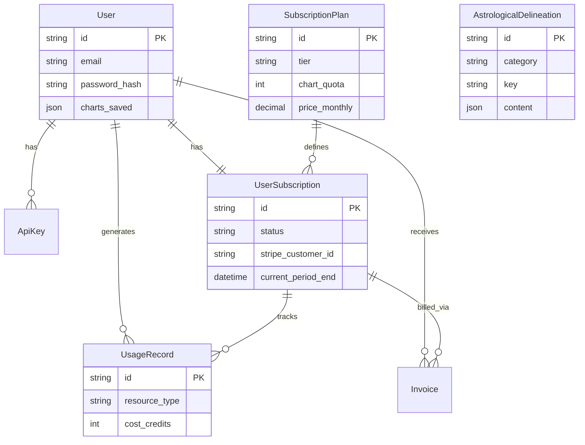

# 03. Data Dictionary

## 1. Entity-Relationship Diagram (ERD)

## 2. Table Definitions

### `users`
Core identity table.
- **Key Fields**: `email`, `password_hash`, `salt`.
- **JSON Fields**: `charts_saved` (Stores user's saved charts as a list of JSON objects).

### `subscription_plans`
Defines the tiers (Free, Practitioner, etc.).
- **Tiers**: Defined in `tier` column.
- **Quotas**: `chart_quota`, `api_quota` control access.

### `user_subscriptions`
Links Users to Plans and Stripe.
- **Stripe**: `stripe_customer_id`, `stripe_subscription_id`.
- **Lifecycle**: `status` (active, past_due, canceled), `current_period_end`.

### `usage_records`
Metered usage tracking.
- **Purpose**: Tracks every chart generation or API call for quota enforcement.
- **Relation**: Linked to `UserSubscription`.

### `astrological_delineations`
The "Brain" of the engine. Stores the text for interpretations.
- **Category**: Grouping (e.g., `planets_in_signs`).
- **Key**: Lookup key (e.g., `SATURN_ARIES_DAY`).
- **Content**: The actual interpretation text or JSON structure.
- **Override**: `is_manual_override` allows preventing auto-updates from JSON files.

## 3. API Surface (Route Map)

### V1 Endpoints (`/api/v1`)

| Tag | Prefix | Controller | Purpose |
|-----|--------|------------|---------|
| **Auth** | `/auth` | `src.api.v1.endpoints.auth` | Login, Register, Password Reset |
| **Charts** | `/` | `src.api.v1.endpoints.charts` | Core natal calculations |
| **Forensic** | `/forensic` | `src.api.v1.endpoints.forensic` | Deep audit/kakosis analysis |
| **Medical** | `/` | `src.api.v1.endpoints.medical` | Iatromathematics (Decumbiture) |
| **Mundane** | `/` | `src.api.v1.endpoints.mundane` | World astrology (Ingresses, Eclipses) |
| **Electional**| `/` | `src.api.v1.endpoints.electional`| Timing selection |
| **Billing** | `/billing` | `src.api.v1.endpoints.billing` | Stripe portal, Plans, Usage |
| **Admin** | `/admin` | `src.api.v1.endpoints.admin` | User management, stats |
| **Owner** | `/owner` | `src.api.v1.endpoints.owner` | System-critical overrides |
| **Content** | `/content` | `src.api.v1.endpoints.content`| Retrieve/Edit delineations (CMS) |

### V2 Endpoints (`/api/v2`)
- **Status**: Beta/Placeholder for future versioning.
