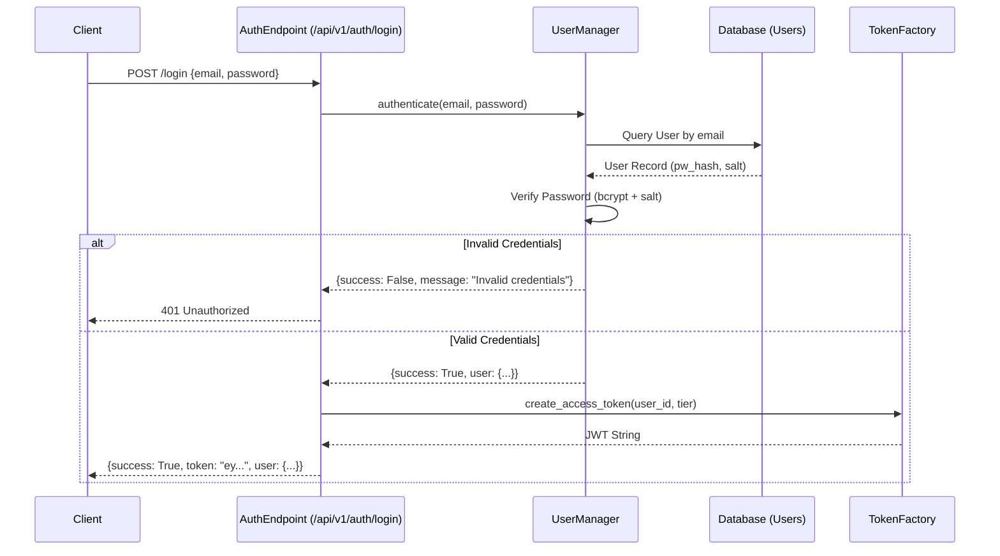
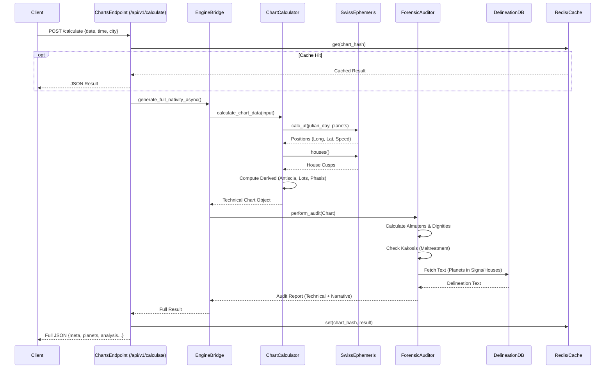
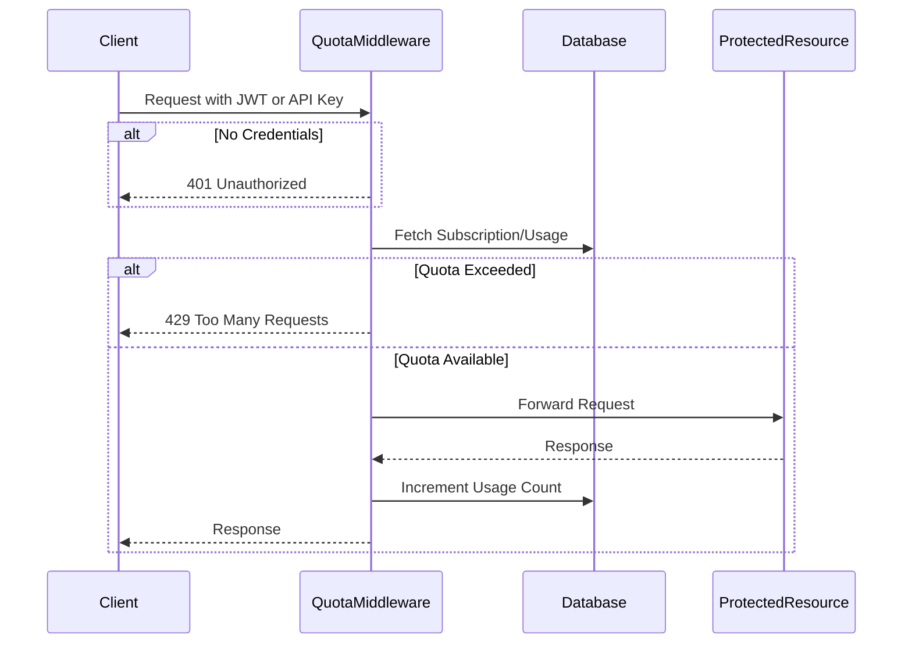

# 04. Core Flows (The Nervous System)

## 1. Authentication Flow (Login)
**Goal**: Securely authenticate a user and issue a JWT for session management.

## 2. Chart Calculation & Forensic Audit
**Goal**: Calculate high-precision planetary positions and perform a forensic astrological audit.

## 3. Subscription Verification (Middleware)
**Goal**: Verify request entitlements before allowing processing.

## 4. Key Components Interaction

| Component | Responsibility | Dependencies |
|-----------|----------------|--------------|
| `src.engine.chart_calculator` | **Physics Engine**: Pure astronomical calculation. | `pyswisseph`, `geopy`, `timezonefinder` |
| `src.engine.forensic_engine` | **Logic Engine**: Applies traditional rules (e.g., Bonatti/Valens). | `chart_calculator`, `database` |
| `src.database.db_manager` | **Knowledge Base**: Retrieves interpretative text. | `SQLAlchemy` |
| `src.api.v1.endpoints` | **Gateway**: Validation, Auth, Response formatting. | `fastapi`, `pydantic` |
