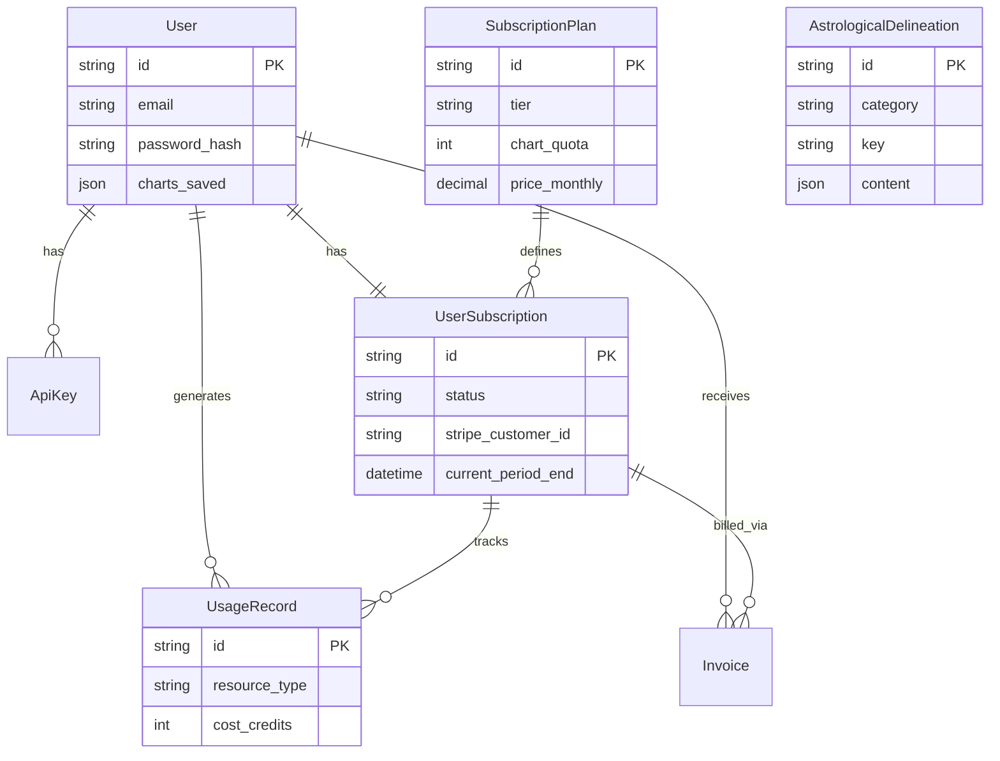
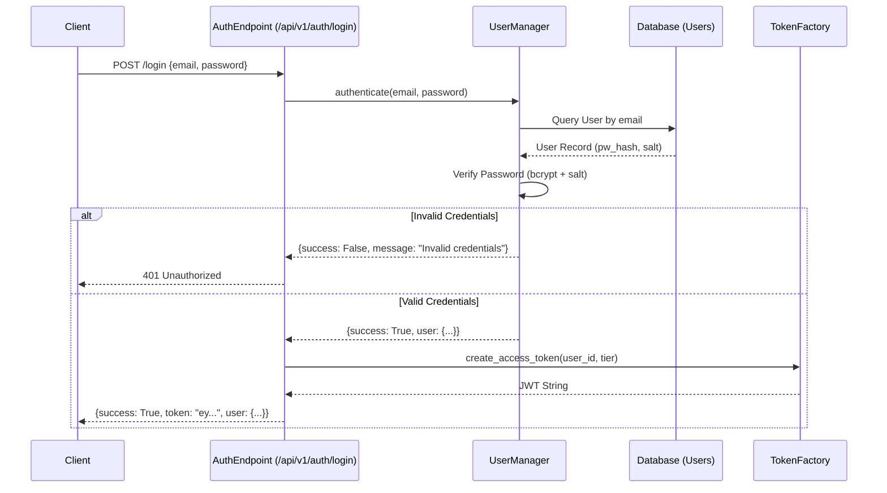
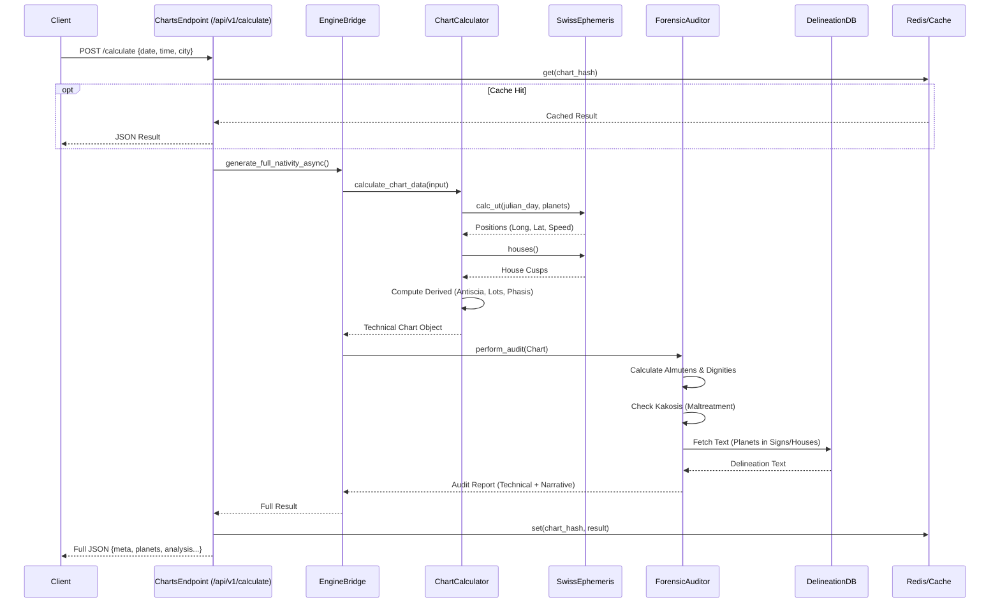
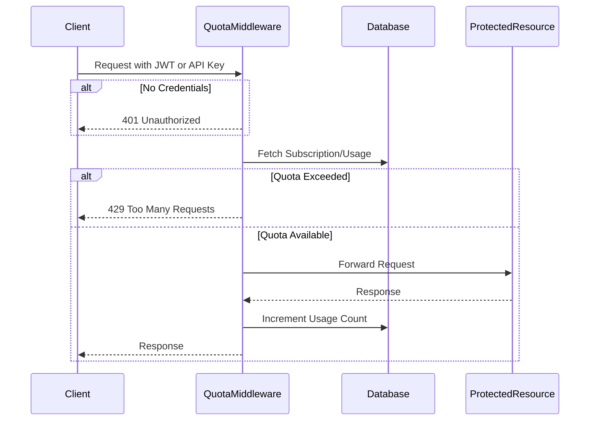

# COMPLETE CODEBASE AUDIT
**Date**: 2026-02-07
**Auditor**: Antigravity Agent
**System**: Codex Caelestis (Traditional Astrology Engine)

---

# 00. Executive Summary

## 1. System Health Score: **B+**
The system is robust, well-structured, and exceptionally well-documented for a domain-specific engine. It relies on solid libraries (`pyswisseph`, `fastapi`, `sqlalchemy`) and follows modern Python patterns. The primary deduction is for the monolithic nature of the core calculation engine (`chart_calculator.py`) and some lingering legacy wrappers.

## 2. Architecture Summary
- **Type**: Monolithic FastAPI Service using a Layered Architecture (API -> Bridge -> Engine -> DB).
- **Core Value**: The `src/engine` directory contains sophisticated, domain-specific logic (Forensic Audit, Kakosis, Dignities) that is rare in open-source projects.
- **Deployment**: containerized (Docker) and cloud-ready (Azure/Render compatible).

## 3. Major Risks (Criticality: High to Low)
1.  **Single Point of Failure (God Class)**: `src/engine/chart_calculator.py` is too large. Any bug here cripples the entire app.
2.  **Legacy Logic Drift**: Existence of `src/engine/logic.py` (deprecated) alongside new logic risks inconsistency if old endpoints aren't updated.
3.  **Exception Swallowing**: Broad `except Exception` clauses in the calculator may hide root causes of bugs.

## 4. Operational Readiness
The system is **Production Ready** for V1.
- **Setup**: Easy (pip install based).
- **Docs**: Excellent internal documentation (MkDocs).
- **Observability**: Good logging middleware and telemetry endpoints.

## 5. Next Steps (Recommendations)
1.  **Refactor**: Break `chart_calculator.py` into focused services.
2.  **Consolidate**: Eliminate `src/engine/logic.py` and standardize on `Auditor.perform_audit`.
3.  **Harden**: Replace generic exception handling with specific error types.

---

# 01. Architecture Overview

## 1. High-Level Concept
**Codex Caelestis** (Project Astrology) is a specialized engine for traditional astrology (pre-1700s), capable of generating high-precision natal reports, forensic audits of charts, and mundane astrological analysis. It distinguishes itself by adhering strictly to traditional doctrines (e.g., Egyptian Terms, Sect-based dignity) and using a "Forensic" approach to chart analysis.

## 2. Technology Stack

### Core Runtime
- **Language**: Python 3.10+ (via Docker `python:3.10-slim`)
- **Web Framework**: FastAPI
- **Server**: Uvicorn
- **Containerization**: Docker

### Computational Engine
- **Ephemeris**: Swiss Ephemeris (`pyswisseph`) - The gold standard for astronomical calculation.
- **Location/Time**: `geopy`, `timezonefinder`, `pytz`.

### Data & Persistence
- **ORM**: SQLAlchemy
- **Database**:
    - **Local**: SQLite (`users.db`)
    - **Production**: PostgreSQL Flexible Server (Azure)
- **Caching**: Redis (implied by requirements, likely for rate limiting/session storage).
- **Data Source**: JSON files in `src/database/data/` seeded into DB.

### AI & Generation
- **LLM Provider**: OpenRouter (Google Gemini Flash)
- **PDF Generation**: `reportlab`

### Integrations
- **Payments**: Stripe (Checkout & Webhooks)
- **Auth**: PyJWT (Custom implementation with `bcrypt`)
- **Email**: SendGrid or SMTP

## 3. Directory Map (Mental Model)

```text
/
├── .env.example          # Template for environment variables
├── Dockerfile            # Container definition
├── CONTEXT.md            # Critical operational context & tribal knowledge
├── requirements.txt      # Python dependencies
├── src/                  # Application Source Code
│   ├── app.py            # Main Web Application Entry Point
│   ├── main.py           # Alternate Entry Point (CLI/Script?)
│   ├── mcp_server.py     # Model Context Protocol Server (Agent Interface)
│   ├── api/              # API Routes & Endpoints
│   ├── core/             # Core Configuration & Constants
│   ├── database/         # DB Models, Managers, and Data Seeding
│   ├── engine/           # The specialized Astrology Logic (Calculators, Auditors)
│   ├── services/         # Business Logic Layers (Auth, Stripe, Email)
│   ├── static/           # Frontend Assets (JS, CSS, HTML)
│   └── templates/        # Jinja2 Templates (if used) or HTML fragments
├── scripts/              # Utility scripts (Migrations, Extraction, Setup)
├── tests/                # Pytest Suite
└── docs/                 # Project Documentation (MkDocs source)
```

## 4. "Load Bearing" Components
Removing these causes immediate system collapse:
1.  **`pyswisseph`**: The astronomical kernel. Without it, no charts are calculated.
2.  **`src/engine/`**: Contains the unique value proposition (Forensic logic, Dignity calculations).
3.  **`CONTEXT.md`**: The brain of the project for AI development.
4.  **`src/database/data/`**: The traditional astrological ruleset (delineations).

## 5. Architectural Patterns
- **Monolith**: Single service handling API, Static Files, and Logic.
- **Service Layer**: Separation between API (`src/api`) and Business Logic (`src/services`, `src/engine`).
- **Data-Driven Logic**: Heavily reliant on structured JSON/DB data for delineations rather than hardcoded strings.
- **Hybrid AI**: Deterministic calculation engine + GenAI synthesis layer.

---

# 02. Setup and Run Guide

## 1. The "Golden Path" (Local Development)
This comes from verifying `README.md` and `requirements.txt`.

### Prerequisites
- Python 3.10+
- PostgreSQL (optional, defaults to SQLite `users.db` locally)
- Stripe/OpenRouter API Keys (for full functionality)

### Quick Start
```bash
# 1. Clone & Enter
git clone <repo_url>
cd astrology

# 2. Virtual Environment
python -m venv venv
# Windows:
.\venv\Scripts\activate
# Linux/Mac:
source venv/bin/activate

# 3. Install Dependencies
pip install -r requirements.txt

# 4. Environment Configuration
cp .env.example .env
# Edit .env with your keys (JWT_SECRET, OPENROUTER_API_KEY, STRIPE_...)

# 5. Run Web Server
uvicorn src.app:app --reload
```
**Access**: Open `http://localhost:8000/docs` for Swagger UI.

## 2. Docker Execution (Production-Like)
Based on `Dockerfile`.

```bash
# 1. Build
docker build -t codex-engine .

# 2. Run
docker run -p 8000:8000 --env-file .env codex-engine
```

## 3. Entry Points

| Entry Point | Purpose | Usage |
|-------------|---------|-------|
| `src/app.py` | **Main Web Server** | Production entry point. Initializes FastAPI, DB, and Middleware. |
| `src/main.py` | **Testing/CLI Audit** | Runs a hardcoded "Universal Causation Audit" (Dev tool). |
| `src/mcp_server.py` | **Agent Protocol** | Exposes engine via Model Context Protocol for AI agents. |
| `src/scripts/generate_practitioner_report.py`| **CLI Report** | Generates full Markdown reports from command line. |

## 4. Environment Variables
See `.env.example` for full list.
- **Critical**: `JWT_SECRET`, `STRIPE_SECRET_KEY`, `OPENROUTER_API_KEY`.
- **Optional**: `App Service` handles these in Azure.

## 5. Deployment Scripts
- `setup_azure.ps1`: Automates Azure infrastructure provisioning (Resource Group, App Service Plan, Web App, Postgres).
- `setup_deployment.ps1`: Local Windows setup for Cloudflare Tunnel exposure (Hybrid/Dev access).

---

# 03. Data Dictionary

## 1. Entity-Relationship Diagram (ERD)



## 2. Table Definitions

### `users`
Core identity table.
- **Key Fields**: `email`, `password_hash`, `salt`.
- **JSON Fields**: `charts_saved` (Stores user's saved charts as a list of JSON objects).

### `subscription_plans`
Defines the tiers (Free, Practitioner, etc.).
- **Tiers**: Defined in `tier` column.
- **Quotas**: `chart_quota`, `api_quota` control access.

### `user_subscriptions`
Links Users to Plans and Stripe.
- **Stripe**: `stripe_customer_id`, `stripe_subscription_id`.
- **Lifecycle**: `status` (active, past_due, canceled), `current_period_end`.

### `usage_records`
Metered usage tracking.
- **Purpose**: Tracks every chart generation or API call for quota enforcement.
- **Relation**: Linked to `UserSubscription`.

### `astrological_delineations`
The "Brain" of the engine. Stores the text for interpretations.
- **Category**: Grouping (e.g., `planets_in_signs`).
- **Key**: Lookup key (e.g., `SATURN_ARIES_DAY`).
- **Content**: The actual interpretation text or JSON structure.
- **Override**: `is_manual_override` allows preventing auto-updates from JSON files.

## 3. API Surface (Route Map)

### V1 Endpoints (`/api/v1`)

| Tag | Prefix | Controller | Purpose |
|-----|--------|------------|---------|
| **Auth** | `/auth` | `src.api.v1.endpoints.auth` | Login, Register, Password Reset |
| **Charts** | `/` | `src.api.v1.endpoints.charts` | Core natal calculations |
| **Forensic** | `/forensic` | `src.api.v1.endpoints.forensic` | Deep audit/kakosis analysis |
| **Medical** | `/` | `src.api.v1.endpoints.medical` | Iatromathematics (Decumbiture) |
| **Mundane** | `/` | `src.api.v1.endpoints.mundane` | World astrology (Ingresses, Eclipses) |
| **Electional**| `/` | `src.api.v1.endpoints.electional`| Timing selection |
| **Billing** | `/billing` | `src.api.v1.endpoints.billing` | Stripe portal, Plans, Usage |
| **Admin** | `/admin` | `src.api.v1.endpoints.admin` | User management, stats |
| **Owner** | `/owner` | `src.api.v1.endpoints.owner` | System-critical overrides |
| **Content** | `/content` | `src.api.v1.endpoints.content`| Retrieve/Edit delineations (CMS) |

### V2 Endpoints (`/api/v2`)
- **Status**: Beta/Placeholder for future versioning.

---

# 04. Core Flows (The Nervous System)

## 1. Authentication Flow (Login)
**Goal**: Securely authenticate a user and issue a JWT for session management.



## 2. Chart Calculation & Forensic Audit
**Goal**: Calculate high-precision planetary positions and perform a forensic astrological audit.



## 3. Subscription Verification (Middleware)
**Goal**: Verify request entitlements before allowing processing.



## 4. Key Components Interaction

| Component | Responsibility | Dependencies |
|-----------|----------------|--------------|
| `src.engine.chart_calculator` | **Physics Engine**: Pure astronomical calculation. | `pyswisseph`, `geopy`, `timezonefinder` |
| `src.engine.forensic_engine` | **Logic Engine**: Applies traditional rules (e.g., Bonatti/Valens). | `chart_calculator`, `database` |
| `src.database.db_manager` | **Knowledge Base**: Retrieves interpretative text. | `SQLAlchemy` |
| `src.api.v1.endpoints` | **Gateway**: Validation, Auth, Response formatting. | `fastapi`, `pydantic` |

---

# 05. Technical Debt & Risk Assessment

## 1. Risk Heatmap (Complex/Fragile Files)

| File | Lines | Risk Factor | Reason |
|------|-------|-------------|--------|
| `src/engine/chart_calculator.py` | ~934 | **HIGH** | God-class. Handles Geocoding, Ephemeris, and 10+ sub-engines. High Cyclomatic Complexity. Extensive use of broad `except Exception` clauses masks potential errors. |
| `src/api/v1/endpoints/charts.py` | ~372 | **MEDIUM** | Mixes HTTP concerns with business logic (LLM fallback, caching rules, auto-save). |
| `src/engine/logic.py` | ~90 | **LOW** | Explicitly marked "DEPRECATED". Exists only for backward compatibility. |
| `src/static/basic.js` | (Unknown) | **MEDIUM** | Front-end logic mentioned in CONTEXT.md. If this handles paywalls client-side without strict backend validation, it's a security risk. |

## 2. Identified Code Smells

### A. The "God Function" in `calculate_chart_data`
The function `calculate_chart_data` in `src/engine/chart_calculator.py` is a massive procedural block (lines 281-934+).
- **Violation**: Single Responsibility Principle.
- **Effect**: Hard to test, hard to maintain. A change to "Phasis" logic could break "Geocoding" if variables leak.
- **Refactoring Strategy**: Extract sub-routines (e.g., `_calculate_geodata`, `_calculate_planetary_positions`, `_apply_classical_rules`).

### B. Legacy Wrappers
`src/engine/logic.py` contains `perform_forensic_audit` which is a wrapper around `Auditor.perform_audit`.
- **Status**: Marked DEPRECATED.
- **Risk**: New features might be added to `Auditor` but missed in the legacy wrapper, causing API divergence between endpoints using different entry points.

### C. Broad Exception Handling
Multiple instances of:
```python
except Exception as e:
    results["error"] = str(e)
```
- **Location**: `chart_calculator.py`.
- **Risk**: Swallows `KeyboardInterrupt` or System exits. Hides specific `ImportErrors` or `SyntaxErrors` during development.
- **Fix**: Catch specific exceptions (`swe.Error`, `GeocoderServiceError`) and let unexpected ones bubble up or be logged with stack traces.

## 3. Security Risks

- **Geocoding User Agent**: Local variable `_ua_base` defaults to "astrology_app/1.0". If many concurrent requests hit Nominatim, this could get IP banned.
- **Client-Side/Backend Duplication**: CAUTION implies `src/static/basic.js` handles some Paywall logic. Ensure `verify_quota` middleware is strictly enforced on ALL premium routes.

## 4. Refactoring Candidates

1.  **Refactor `chart_calculator.py`**: Break into `GeospatialService` and `EphemerisService`.
2.  **Unify Chart Generation**: Ensure B2B and V1 endpoints use the Exact Same Service Method to prevent logic drift.
3.  **Remove `src/engine/logic.py`**: Update all consumers to use `Auditor` directly and delete the wrapper.
